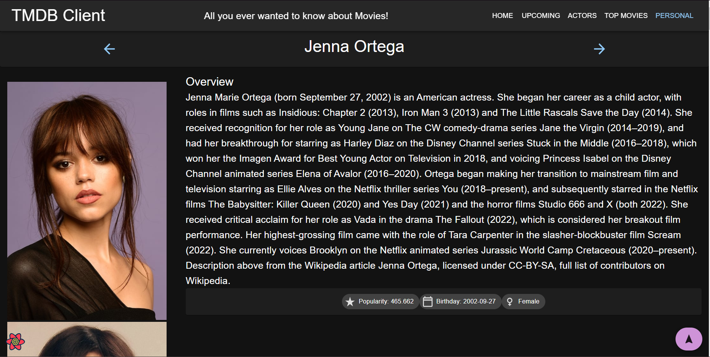
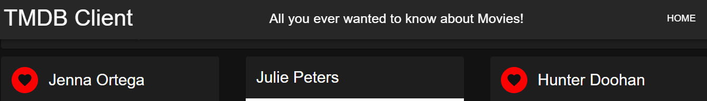
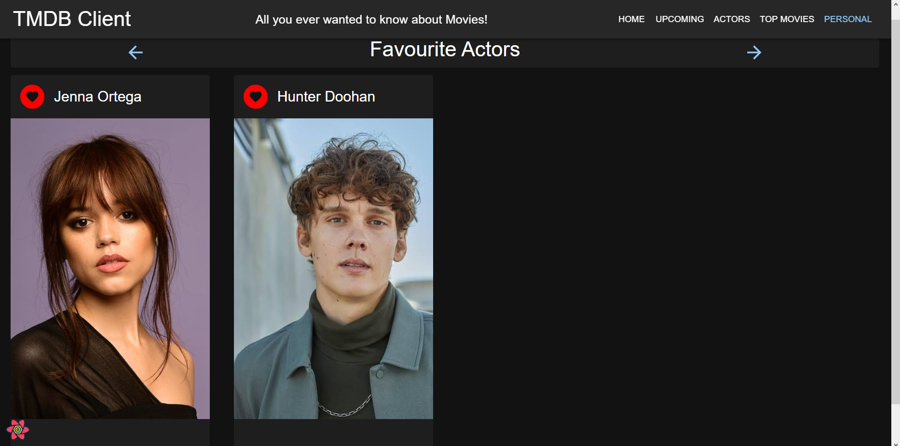
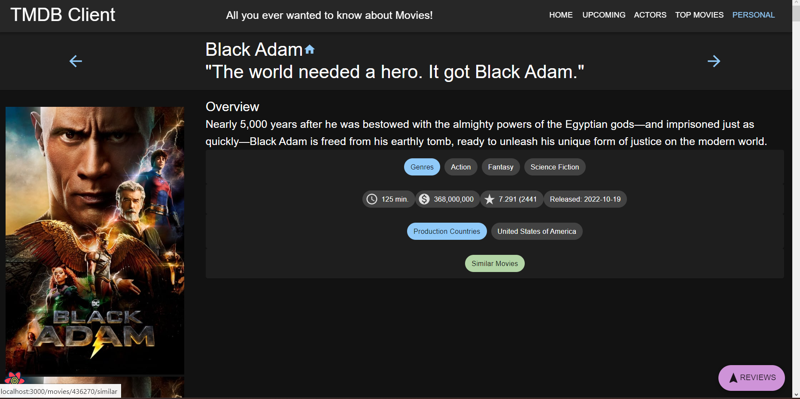
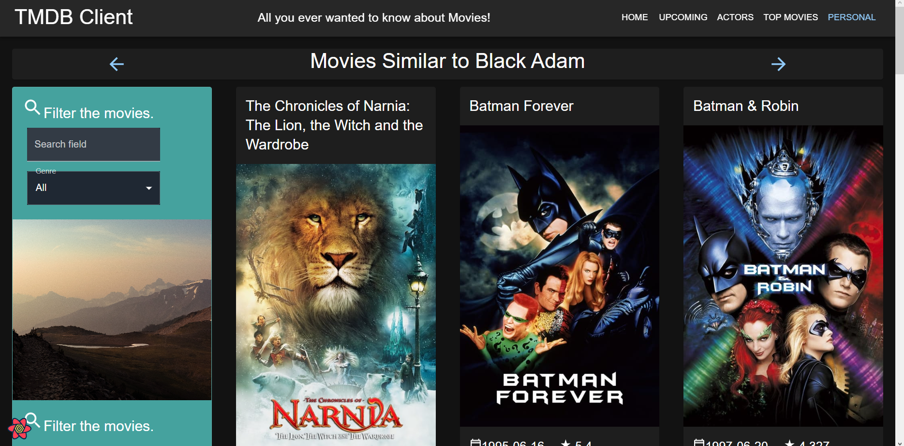
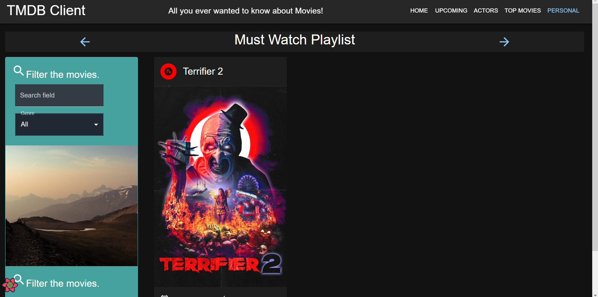

# Web App Dev 2 - Assignment 1 - ReactJS app.

Name: Ethan Roche Woodward

## Overview.

### New Pages.

- List of All Time Movies on TBDM
- List of Popular Actors
- Actor Details Page
- Favourite Actors Page
- Must Watch Playlist Page
- Similar Movies Page

### New Features.

## Setup requirements.

## TMDB endpoints.

- /movie/{movie_id}/similar - A list of similar movies.
- /person/popular - A list of popular actors.
- /person/{id} - Details on the selected actor.
- /movies/top - Top movies of all time.

## App Design.

### Component catalogue.

### UI Design.

> Changed the entire app to being in Dark Mode.

> Shows a list of currently popular actors.

> Shows detailed information on an actor.

> Allows the user to select their favourite actors and view them on a favourites page.

> Allows the user to view movies similar to the one they are currently looking at.

> Allows the user to add upcoming movies to a must watch playlist and view that playlist.

### Routing.

- /actors - displays a list of popular actors.
- /actors/:id - shows details about a particular actor.
- /movies/:id/similar - shows movies similar to the selected movie.
- /movies/top - shows top movies of all time on TMDB.

## Independent learning (If relevant).

- Followed https://mui.com/material-ui/customization/dark-mode/#dark-mode-by-default to implement dark mode across the entire app
