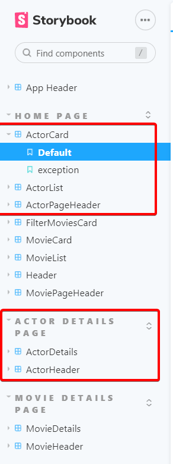
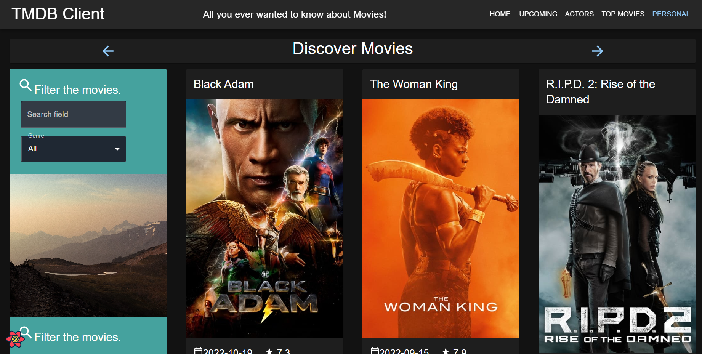
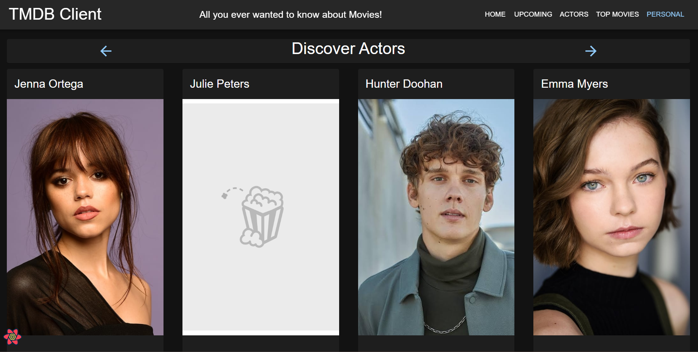

# Web App Dev 2 - Assignment 1 - ReactJS app.

Name: Ethan Roche Woodward

## Overview.

### New Pages.

- List of All Time Movies on TBDM
- List of Popular Actors
- Actor Details Page
- Favourite Actors Page
- Must Watch Playlist Page
- Similar Movies Page

### New Features.

[ Provide a bullet-point list of the __new features__ you added to the Movies Fan app.]

e.g.

- Authentication (using Firebase)
- Create a fantasy movie (Basic)
- Sort movie list by release date (e.g. the Discover Movies page)
- etc

## Setup requirements.

## TMDB endpoints.

- /movie/{movie_id}/similar - A list of similar movies.
- /person/popular - A list of popular actors.
- /person/{id} - Details on the selected actor

## App Design.

### Component catalogue.

### UI Design.

[ Insert screenshots of the **new app pages** you developed (including modified existing pages), Have an appropriate caption for each one (see example below).

> Changed the entire app to being in Dark Mode.

> Shows detailed information on a movie. Clicking the 'Reviews' floating action button will display extracts from critic reviews.

> Shows a list of currently popular actors.

### Routing.

[ List the __new routes__ supported by your app and state the associated page.]

e.g.

- /actors - displays a list of popular actors.
- /actors/:id - shows details about a particular actor.
- /actors/:id/movies (protected) - an actor's movie credits.
- etc.

[If relevant, state what aspects of your app are protected/private (i.e. require authentication) and what is public.]

## Independent learning (If relevant).

[ Itemize the technologies/techniques you researched independently and adopted in your project, i.e. aspects not covered in the lectures/labs. Mention the source code filenames that illustrate these (code excerpts are not required) and provide references to the online resources that helped you (articles/blogs).
